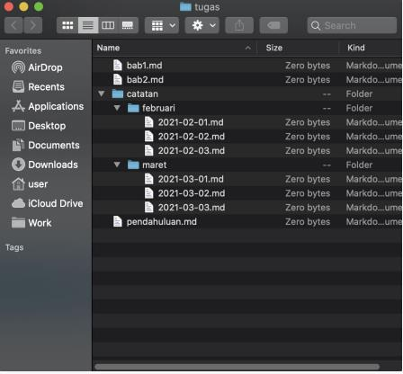
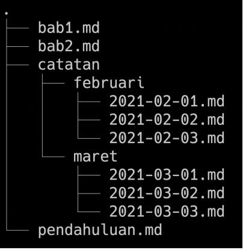
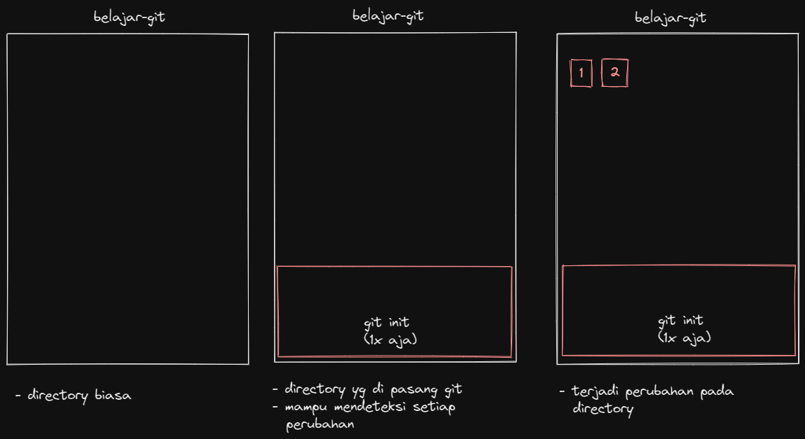
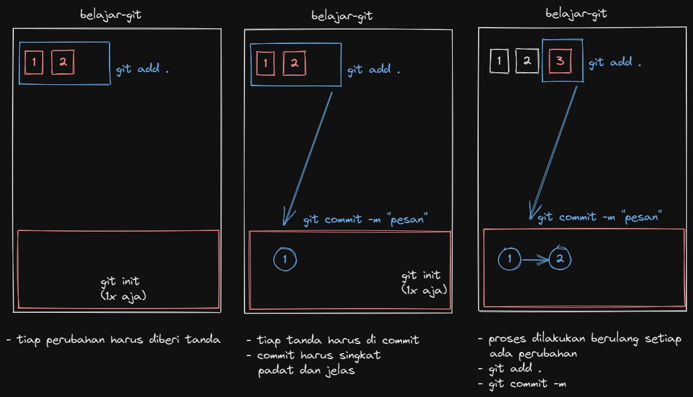
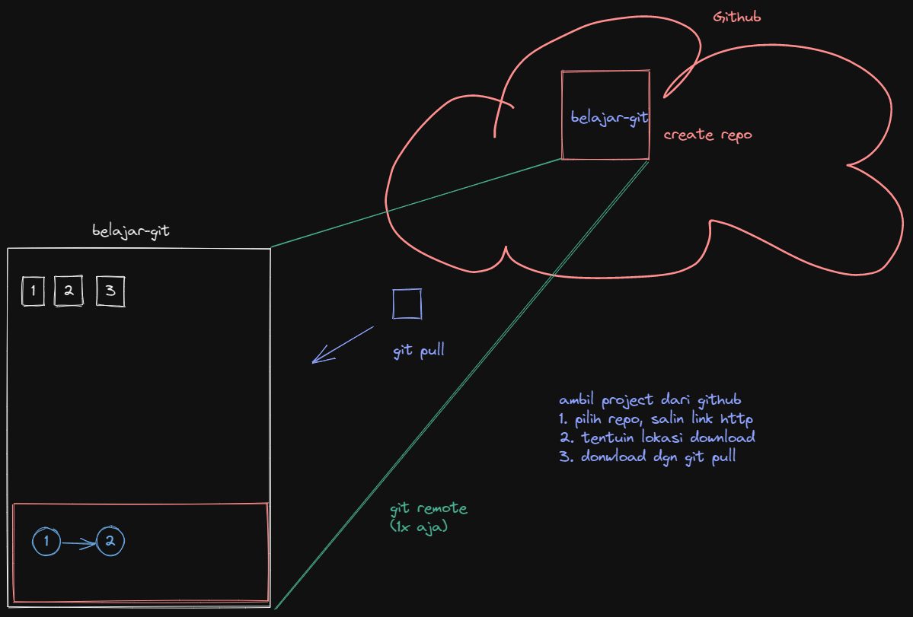
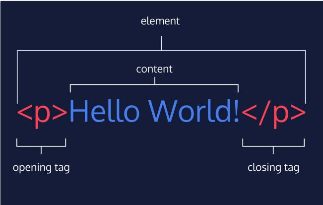
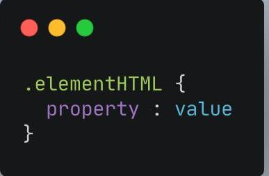
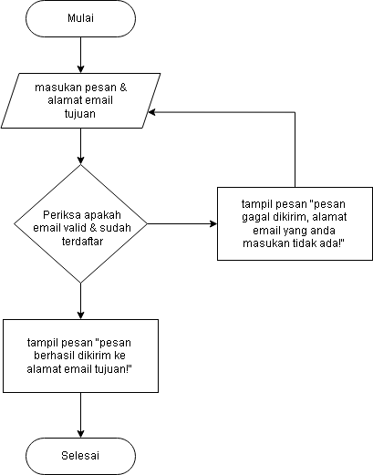

# **Writing and Presentation Test Week 1**
# **Day 1 : Unix Comand Line Interface & Git - GitHub**
## **Unix Comand Line**
**Pengertian Shell :** Shell adalah program yang dapat menerima perintah dari kita, lalu diteruskan ke system sehingga dapat menjadi suatu instruksi yang dapat menghasilkan suatu output.

### **Shell terbagi menjadi 2 tipe yaitu :** 

- Shell Berbasis Text : sh, bash, zsh, cmd.exe, windows powershell.
- Shell Berbasis Grapich / GUI : windows 10, ubuntu, macOs.

### **File System & Root Directory** :
<figure>

<figcaption>Tampilan File System dan Root Directory di GUI</figcaptiom>
</figure>
<figure>

<figcaption>Tampilan File System dan Root Directory di CLI</figcaptiom>
</figure>


### **Berikut Contoh Perintah yang sering dipakai pada Comand Line Interface :**
#### Navigasi
- `pwd`  : melihat directory saat ini yang sedang aktif berdasarkan root directory
- `cd <directory location>`  : berpindah directory berdasarkan current directory
- `ls`  : melihat isi directory
- `clear` : membersihkan terminal

#### File Manipulation
- `touch <name file.ekstention>`   : membuat file baru dengan ekstensi yang sudah ditentukan
- `cp <name file.ekstention> <location>`      : menduplikat file
- `mv <name file.ekstention> <location>`      : memindahkan file, selain itu bisa digunakan untuk rename
- `rm <name file.ekstention>`      : menghapus file secara permanen

#### Directory Manipulation
- `mkdir <name directory>`   : membuat directory baru
- `cp <name directory> <location>`      : menduplikat file atau directory
- `mv <name directory> <location>`      : memindahkan directory, selain itu bisa digunakan
- `rm <-d> <name directory>`      : menghapus directory secara permanen

#### Text
- `cat <name file.ekstention>` : melihat isi text dari keseluruhan file
- `nano <name file.ekstention>` : mengedit file

## **Git & GitHub**
### **Pengertian apa itu Git**
Git adalah Tools wajib bagi programmer yaitu sebagai Version Control System atau bisa disingkat dengan VCS yang berfungsi sebagai tools yang dapat merekam aktifitas source code kita ataupun 
melacak setiap perubahan 
yang terjadi pada folder ataupun file yang ada didalam projek yang biasa disebut dengan repositori.

### **Bedanya dengan GitHub?**
GitHub adalah merupakan manajemen project, sistem versioning code, sekaligus platform jaringan sosial bagi para developer seluruh dunia. Banyak sekali fungsi yang bisa digunakan oleh para developer, sehingga melalui platform ini memudahkan developer dalam mengembangkan sebuah karya.

GitHub juga memberikan layanan cloud untuk menyimpan dan mengelola project/repository git. Karena bersifat online, kita meng-edit sebuah repository/project secara bersamaan dengan orang lain di tempat yang berbeda. Oleh karena itu, platform ini sangat membantu tim project dalam menyusun suatu folder yang berisikan files terkait pemrograman.

### **Alur Kerja dari Git**
- Konfigurasi git
- Masukan perintah `git config global user.name <username>` untuk konfigurasi username
- Masukan perintah `git config global user.email <email>` untuk konfigurasi email
- Melihat hasil konfigurasi dengan `git config --list Config list`
- Tentukan directory yang ingin kita jadikan sebagai repositori dengan memberikan command `git init`
- Jika sudah kita jadikan sebagai repositori maka git dapat melacak setiap perubahan yang ada dalam repo directory
- Kita dapat mengecek tiap perubahan tersebut dengan memberi perintah `git status` 

- Jika setelah kita cek terdapat perubahan, kita dapat menyimpan perubahan tersebut ke dalam staging area sehingga perubahan tersebut siap kita commit
- Kita dapat menyimpan perubahan dengan melakukan commit dengan memberi command `git commit -m <pesan>` 
 - Setelah kita berhasil melakukan commit, kita dapat mengupload perubahan yang terjadi di lokal repositori ke public atau cloud repositori yang ada di github, untuk dapat melakukan itu kita harus mempunyai akun github terlebih dahulu dan membuat repositori baru
 - Setelah berhasil membuat repositori, kita harus menambahkan remote terlebih dahulu agar repositori lokal kita dapat terhubung ke github, kita dapat menggunakan perintah `git remote add origin <link repo>`
 - Setelah berhasil menambahkan remote, kita dapat melakukan push ke repositori github dengan menggunakan perintah `git push -u origin <nama branch>`
 - Jika kita liat di repositori github maka akan terlihat kalau perubahan-perubahan yang kita lakukan sebelumnya di lokal berhasil berpindah! 

 Yang tadi itu adalah alur jika kita ingin membuat projek dari lokal dan ingin mengupload perubahan dari lokal ke public repositori, tapi bagaimana jika kita ingin mengambil projek dari github sehingga bisa kita jadikan sebagai lokal projek kita? 
 - Kita bisa mengkloning projek atau repositori dari github, caranya cukup dengan menyalin link dari repo yang kita inginkan lalu gunakan perintah `git clone <link repo>` pada terminal bash
 - Selain menggunakan perintah `git clone` kita juga bisa mengambil projek dengan melakukan perintah `git pull` untuk menarik tiap perubahan yang ada di repo 
# **Day 2 : HTML - Hypertext Markup Languange**
## **Pengertian HTML**
Hypertext Markup Languange atau singkatnya disebut HTMl adalah bahasa markup yang biasa digunakan untuk membuat struktur konten pada suatu website, HTML merupakan pondasi utama dalam membangun visual yang kita tampilkan pada antarmuka web browser.
## **Tools yang dapat digunakan untuk membuat HTML**
- Tools yang dibutuhkan untuk untuk membuat HTML yaitu web browser dan code editor
- Visual Studio Code merupakan salah satu code editor yang dibuat oleh Misrosoft
- Keunggulan dari Visual Studio Code yaitu Intellisense, Run and Debug,Built in Git, Extensions
- HTML Structure
```
<!DOCTYPE html>
<html lang="en">
<head>
    <meta charset="UTF-8">
    <meta name="viewport" content="width=device-width, initial-scale=1.0">
    <title>My Blog</title>
    <link href="coba.css" type="text/css" rel="stylesheet"/>
</head>
    <body>
        <div>
            <h1 class="header">Hi! This is my Blog</h1>
            <p>I love learning and sharing</p>
        </div>
    </body>
</html>
```

## **Anatomi pada HTML**


- HTML Element terdiri atas opening tag, content, dan closing tag
Opening Tag : <p>
Content : Hello World
Closing Tag : </p>
- HTML Attributes : properties dari sebuah element HTML. Contohnya yaitu id,class,name
- Single Tag atau singular tag
`<br/>`
`<hr/>`
``
- Paired Tag atau double Tag
`<h1> </h1>`
- HTML Comment digunakan untuk memberi keterangan pada suatu line code `<!-- -->`
- Salah satu cara menjalankan HTML yaitu menggunakan "Live Server"
- Pembuatan Tabel
```         
         <table border="1">
            <thead>
                <tr>
                    <td>Nama</td>
                    <td>Umur</td>
                    <td>Hobby</td>
                </tr>
            </thead>
            <tbody>
                <tr>
                    <td>Chaca</td>
                    <td>22 y.o</td>
                    <td>Reading Novel</td>
                </tr>
            </tbody>
        </table>
```
## **Semantic HTML**
yaitu menggunakan elemen HTML sesuai dengan kebutuhan konten. **Contoh :** header, footer, nav, section, aside, dll.
```
<body>
  <header>
    <h1>My Blog</h1>
  </header>
  <nav>
    <a href="#">Home</a> |
    <a href="#">About</a> |
    <a href="#">Contact</a>
  </nav>
  <article>
    <h1>Welcome To My Blog!</h1>
    <p>Perkenalkan nama saya Ulfa Zakiatul Mardhiah. Biasa dipanggil chaca. Saat ini aku tenggah menempuh semester 8 di Universitas Muhammadiyah Malang. 
    </p>
  </article>
  <footer>
    Copyright &copy; 2022 by chacacaliza
  </footer>
</body>
```

# **Day 3 : CSS - Cascanding Style Sheet**
## **Pengertian CSS**
Cascanding Style Sheet atau yang biasa disingkat dengan CSS adalah bahasa yang digunakan untuk memberikan styling seperti mengubah warna, menggunakan font custom, editing text format, mengatur tata letak pada tiap element tag HTML sehingga membuat tampilan web kita menjadi terlihat menarik.

## **Anatomi CSS**


- . (titik) : merupakan selektor yg menuju pada tag html yg memiliki properti kelas
- CSS comment dapat diberika di external css dan internal css /* */
- Ada 3 cara menggunakan CSS yaitu : <br>
 Inline Tag : menggunakan css lngsng di atribute elemnt html ``style="properti: value;"`` <br>
 Internal Tag : menggunakan tag style di bagian head `<style>code...</style>` <br>
 External Tag : menggunakan file css terpisah dengan html ``<link href="styles.css" type="text/css" rel="stylesheet"/>`` letakan tag link berikut di bagian head
- Properti CSS contohnya yaitu font-size, color, background-color
- CSS - Tag Name <br>
jika menggunakan Tag element HTML maka akan bersifat global yg artinya akan mengubah seluruh html. <br> **Contoh:**   
```h1 {
      color: blue; 
   }
```
- CSS - Class Name dengan cara menggunakan selector class <br>
**Contoh:** <br>
```
.text-color-red{
	        color: red; 
    }
```

- Tag Id dan Tag Class bisa dipake di css namun Tag Class lebih bersifat fleksibel karena dapat diberikan lebih dari 1 nilai sedangkan Tag Id bersifat kaku karena hanya memiliki 1 nilai
- Nested Element yaitu setiap element yang terdiri atas parent dan child
- !important CSS yaitu styling CSS yang memiliki tingkat paling atas dari ID dan Class.

## **Box Model**
Pada dasarnya setiap elemen di HTML dapat dianggap sebagai “box”. Yaitu, sebuah “box” yang membungkus elemen secara keseluruhan. Box tersebut terdiri dari beberapa bagian, yaitu ; margin, border, padding, dan content
- Content : adalah konten dari elemen, biasanya berupa teks atau gambar
- Border : bagian perantara antara inner space dan outer space dari content
- Padding : inner space pada content element
- Margin : outer space atau bisa dibilang bagian terluar dari element 
## **Position**
Position pada CSS di gunakan untuk mengatur posisi sebuah element HTML. Jika kita ingin membuat atau menetapkan posisi sebuah element dengan element yang lain. maka dengan menggunakan property position CSS ini kita dapat menentukan posisi sebuah element HTML sesuai dengan yang kita inginkan.
- Static : Default position yang merupakan lapisan paling bawah.
- Relative : Lapisan diatas static yang dapat kita beri properti top, left, right, bottom untuk dapat berpindah-pindah dari posisi awal.
- Absolute : Lapisan position yang akan mengikuti relative parent terdekat dan menempel diatasnya.
- Fixed : Lapisan Position mutlak yang tidak akan berubah dan relatif terhadap viewport
- Sticky : Lapisan position yang akan berubah menjadi fixed saat kita melakukan scrolling.
## **FlexBox**
- Flexbox adalah suatu cara untuk mengatur layout atau tata letak.
- Flexbox terdiri 1 parent (container) dan bisa beberapa child.
- Flex direction digunakan untuk mengatur letak child.
- Flex wrap mengatur tata letak child pada 1 line.
- Flex flow yaitu digunakan sebagai shortcut untuk set up - flex-direction dan flex-wrap secara bersamaan.
- Order digunakan untuk ordering item yang ingin diatur posisinya.
- Justify - content digunakan untuk mengatur tata letak antar item child secara horizontal.
- Align - content digunakan untuk mengatur tata letak antar item child secara vertikal atau cross axis.
- Flex-grow digunakan untuk mengatur size suatu item child pada flexbox
- Flex-shrink digunakan untuk memperkecil size suatu item child secara relatif terhadap item child lainnya.
- flex-basis digunakan untuk mengatur width setiap item child.
 
# **Day 4 : Algoritma & Data Struktur**
## **Pengertian Algoritma**
Algoritma adalah merupakan langkah-langkah logis yang kita susun secara sistematis untuk dapat menyelesaikan suatu permasalahan.
- Kualitas suatu algoritma :
  - Input & output harus jelas/ didefinisikan terlebih dahulu dgn tepat
  - Setiap step harus benar -benar clear dan tidak ambigu
  - Algoritma seharusnya tidak mengandung suatu code pada bahas pemrograman tertentu. <br />
    algoritma harus dibuat agar dapat digunakan dlm bahas pemrograman apapun
- Kenapa harus mempelajari algotima :
 Karena programming itu identik dengan 
memecahkan suatu permasalahan, maka dari itu 
algoritma merupakan pemeran utamanya. Belajar algoritma sama aja dengan mengingat 
kembali alur berfikir yg terstruktur
## **Ciri-ciri algoritma**
- Input : Memiliki 0 atau lebih inputan.
- Output : Memiliki min 1 buah output.
- Definiteness(pasti) : Instruksi jelas tidak ambigu.
- Finiteness(ada batas) : Memiliki titik berhenti (stop).
- Effectiveness(tepat dan efisien) : Sebisa mungkin tepat sasaran dan efisien.
## **Jenis-jenis algoritma**
- Sequence : Instruksi yg dijalankan. **Contoh:** secara berurutan Gelas diisi dengan air, lalu air siap utk diminum
- Selection : Instruksi yg dijalankan jika memenuhi suatu 
kondisi. **Contoh:** Jika lampu merah, saya akan 
berhenti
- Iteration : Instruksi yg berulang kali dijalankan selama 
memenuhi suatu kondisi. **Contoh:**
Selama belum sampai rumah, 
saya akan terus menyetir
- Concurrent : Instruksi yg dijalankan secara bersamaan. **Contoh:** Ibu mencuci baju sambil 
membersihkan rumah
## **Penyajian Algoritma**
### **Deskriptif**
1. membuka email
2. menginputkan pesan dan alamat email tujuan
### **Flowchart**


### **PseudoCode**
```
DESCRIBE
let email;
BEGIN
let message = INPUT(pesan, alamatEmail) {
    loop(email){
        if(alamatEmail == email){
           return DISPLAY(Pesan terkirim ke email tujuan!)
        }else {
           return DISPLAY(email tidak diketahui!)
        }
    }
}
END
```

- Jenis Pseudocode :
  - Procedural : cara berpikir runut 
  - Conditional: jika dibutuhkan suatu percabangan masalah (if else)
  - Looping    : sebuah perintah yg diulang-ulang

# **Day 5 : JavaScript Dasar**
## **Pengertian JavaScript**
JavaScript adalah bahasa pemogramanan satu-satunya yang dapat digunakan untuk memanipulasi struktur dari web browser, javascriptjuga merupakan bahasa pemograman yang bersifat interpreter dan dinamis sehingga cukup mudah untuk digunakan ketimbang bahasa pemograman lain yang bersifat strict dan harus di compile terlebih dulu untuk menjalankan code.

## **Cara menjalankan JavaScript**
- Kita bisa menggunakan javascript melalui file html dengan memberikag tag ``<script>code...</script>`` lalu menuliskan syntaks-syntaks javascript di dalam tag tersebut.
- Cara kedua adalah dengan membuat file khusus dengan memberi file dengan ekstension .js lalu menghubungkannya di file html dengan memberi atribut src dan alamat file di dalam tag `<script>`. 

**Contoh:**
```
<script src="script.js"><script>
```

  ## **Tipe Data dalam JavaCript**
  - number : 12345
  - string : "hello world"
  - boolean : true or false
  - null : tidak punya nilai
  - undefined : belum didefinisikan 
  - object : kumpulan data yang disimpan dengan key berupa string
  - array : kumpulan data dengan key berupa index atau angka

  ## **Variabel**
  Variabel bisa disebut sebagai tempat penampung data, karena JavaScript bersifat dinamis kita bisa menyimpan data dalam bentuk apapun tanpa menentukan tipe datanya terlebih dahulu.
  ### ada 3 macam cara mendeklarasikan variabel di JavaScipt
  - var
  - let 
  - const

  ## **Operator pada JavaScript**
 ### **Arithmetic Operator**
Arithmetic operator adalah operator yang melibatkan operasi matematika.
- Tambah (+)
- Kuramg (-)
- Perkalian (*)
- Pembagian (/)
- Modulus (%)
### **Comparison operator**
Comparison operator adalah operator yang membandingkan satu nilai dengan 
nilai lainnya. Value yang didapat setelah melakukan comparison operator adalah tipe boolean true or false
- Lebih kecil dari : <
- Lebih besar dari: >
- Lebih kecil atau sama dengan: <=
- Lebih besar atau sama dengan: >=
- Sama dengan: ===
- Tidak sama dengan: !==
### **Logical Operator**
Logical operator biasa digunakan untuk sebuah CONDITIONAL pada pemograman dan dapat menghasilkan nilai BOOLEAN yaitu TRUE or FALSE.


Simbol dari Logical Operator adalah sebagai berikut:
- AND operator : &&
- OR operator: ||
- NOT operator: !

## **Control Flow**
### **Conditional Statement**
Conditional merupakan 
statement percabangan yang 
menggambarkan suatu kondisi.
Conditional statement akan 
mengecek kondisi spesifik dan 
menjalankan perintah
berdasarkan kondisi tersebut
Yang dicek adalah apakah 
kondisi tersebut TRUE (benar).
Jika TRUE maka code didalam 
kondisi tersebut dijalankan.

**Contoh Conditional statement menggunakan IF ELSE :**
```
let spotlight = 'yellow';
if (spotlight === 'red') {
  console.log('Stop!');
} else if (spotlight === 'yellow') {
  console.log('Slow down.');
} else if (spotlight === 'green) {
  console.log('Go!);
} else {
  console.log('Caution, unknown!');
}
```
**Contoh Conditional statement SWITCH CASE :**
- Gunakan switch case jika 
kondisi dan percabangan 
terlalu banyak

```
switch(expression) {
  case value_1 :
      statement_1;
      break;
  case value_2 :
      statement_2;
      break;
  case value_3 :
      statement_3;
      break;
  default :
     default_statement;
}
```
### **Looping**
Looping adalah statement 
yang mengulang sebuah 
instruksi hingga kondisi 
terpenuhi atau jika kondisi 
stop/berhenti tercapai.

**Contoh Looping menggunakan FOR LOOP:**
- Gunakan FOR LOOP jika kita 
tahu seberapa banyak nilai 
pasti untuk pengulangannya.

```
let angka = 1;
for (angka; angka <= 10; angka++) {
    console.log(angka);
}
```
**Contoh Looping menggunakan WHILE LOOP:**
- Gunakan WHILE LOOP jika kita 
tidak mengetahui jumlah pasti 
pengulangan.

```
let angka = 1;
let i = 0;
let success = FALSE;
while(!success){
  if(i == 5){
    console.log('mencetak angka 5');
    return success = TRUE;
  } else {
    return success = FALSE;
  }
  i++;
}
```
**Contoh Looping menggunakan DO WHILE LOOP:**
- Gunakan do while jika ingin menjalankan 
pengulangan 1 kali sebelum 
dilakukan pengecekan kondisi.

```
let bensin = 9;
do {
  console.log("Nyalakan mesin!");
  bensin--;
} while(bensin > 0)
```


