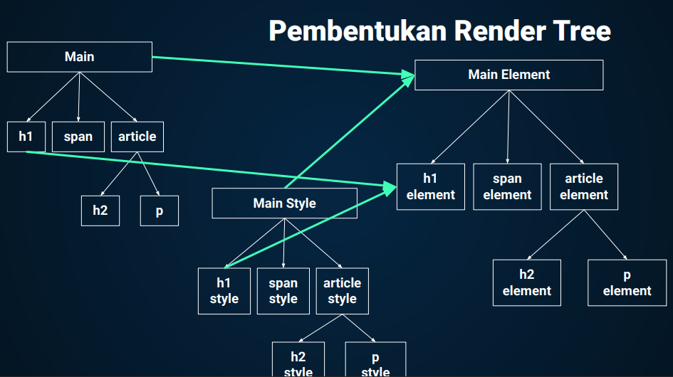
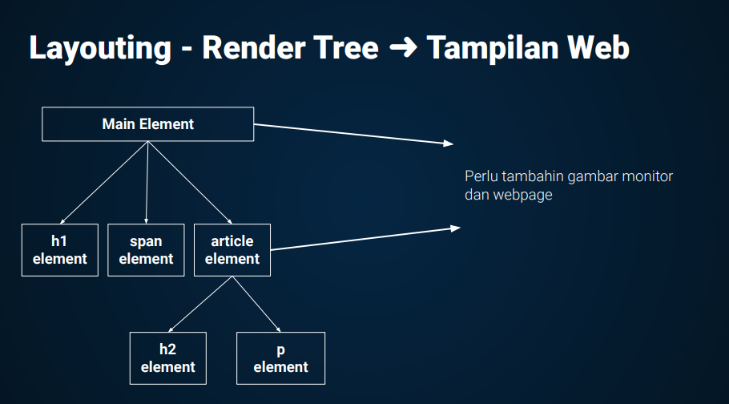

# **Writting & Presentation Test Week 2**
# **Day 1 Scope Variabel & Function**
## **Scope**
### **Apa itu Scope dalam Variabel?**


Yaitu adalah suatu konsep dalam flow data variabel yang menentukan bahwa variabel tersebut dapat diakses pada scope tertentu atau tidak. Scope disini bisa diartikan sebagai lingkup block code.

### **Apa itu Blocks?**

Blocks adalah code yang 
berada didalam curly braces {}.
Conditional, function, dan 
looping menggunakan blocks.


### **Analoginya seperti :**

Kita semua bisa melihat bintang-bintang
dilangit karena bumi bersifat global.
Namun jika kamu tinggal di Bandung, kamu 
tidak akan bisa melihat monas yang berada 
di jakarta. Monas bersifat local yaitu hanya 
berada di Jakarta.

### **Global Scope**

Global Scope adalah bagian scope yang berada diluar dari blocks, yang artinya disini jika kita mendeklarasikan variabel dengan global scope maka variabel tersebut dapat diakses dimanapun dalam suatu file.

**Contoh Global Scope :**
```
let myName = 'Fazlu'; // Global Scope

function greeting() {
    return myName; // Fazlu
}

console.log(greeting()) // Output Fazlu
```
>Disini dapat terlihat kalau variabel yang kita deklarasikan di luar bloks dapat di akses walaupun di dalam bloks sekalipun
### **Local Scope**
Local Scope adalah bagian scope yang berada di dalam blocks, yang artinya jika kita mendeklarasikan variabel didalam suatu blocks seperti function, conditional, loop, dll. Maka kita tidak bisa mengakses variabel tersebut diluar dari blocks.

**Contoh Local Scope :**
```
function greeting() {
    let myName = 'Fazlu';
    return myName;
}

console.log(greeting()); // Output Fazlu
console.log(myName); // Output uncaught ReferenceError: myName is not defined because local scope
```
>Sedangkan untuk local variabel yang kita deklarasikan di dalam bloks tidak dapat kita akses dari luar dan akan menyebabkan error.
## **Function**
### **Pengertian Function**
Function adalah sub program yang terdiri dari sekumpulan perintah dalam blok kode yang biasanya digunakan untuk menyelesaikan suatu task.

**Contoh Function :**
```
function greetWorld() {
    return 'Hello World!';
}
```


### **Kapan kita perlu menggunakan Function ?**
Kita akan membutuhkan function disaat kita akan membuat suatu task yang sama berulang kali, sehingga jika kita tidak ingin membuat perintah yang sama berulang-ulang kita dapat menggunakan function sebagai kerangka dari proses yang ingin kita buat.
### **Cara memanggil Function**
```
greetWorld();   // Memanggil Function
console.log(greetWorld());    // Output: 'Hello World'
```


### **Parameter**
Dengan menggunakan parameter, function dapat menerima sebuah inputan data dan menggunakannya untuk keperluan task yang akan dikerjakan. Kita harus tau data-data apa saja yang kita perlukan jika kita ingin membuat function untuk menyelesaikan suatu task, sehingga kita bisa menginputkan nilai ke parameter dari function yang kita buat.


**Contoh :**
```
function penambahan(a, b) {
    return a + b;
}
```
>Jika kita ingin membuat function berupa penjumlahan dua buah nilai, maka kita harus menyiapkan 2 parameter yang siap diinput ke dalam function, sehingga dapat diproses dan dikembalikan nilainya.

### **Argument Function**
Argument adalah nilai yang kita inputkan ke dalam function saat melakukan pemanggilan, sehingga dari inputan tersebut nilai akan ditampung ke dalam parameter. 


**Contoh :**
```
function penambahan(a, b) {
    return a + b;
}

console.log(penambahan(5, 5)); // Output: 10
```
>Dari contoh kode diatas, perlu kita perhatikan bahwa nilai argument yang kita inputkan harus sesuai dengan parameter yang kita siapkan, guna sebagai wadah yang dapat menampung nilai tersebut.

### **Kapan harus menggunakan return?**
Perlu diperhatikan jika kita ingin function tersebut menghasilkan atau mengembalikan suatu nilai saat dipanggil, kita perlu menambahkan perintah `return`.
### **Default Parameter**
Default parameter bisa digunakan jika kita ingin memberikan nilai awal/default pada parameter function. Dengan begitu kita bisa menjaga agar function tidak error saat kita panggil walaupun tanpa argument.

**Contoh :**
```
function greetOnWebsite(name = 'Stranger') {
    return 'Hello ' + name;
}

console.log(greetOnWebsite('David')); // Output: 'Hello David'
console.log(greetOnWebsite()); // Output: 'Hello Stranger'
```
>Kita bisa melakukan assignment pada parameter kita sehingga jika kita tidak menginputkan argument saat pemanggilan function, secara otomatis parameter dari function akan mengambil nilai default yang sudah kita tetapkan.

### **Jenis - Jenis Function yang dapat digunakan sesuai kebutuhan**
- Declaration Function / Regular Function

**Contoh :**
```
function greeting() {
    return 'Hello World!';
}
```
>Mendeklarasikan function dengan memberi keyword function beserta nama function yang ingin kita berikan.

- Function Expression

**Contoh :**
```
let greeting = function() {
    return 'Hello World!';
}
```
>memasukan function ke dalam variabel sehingga nama function akan mengikuti nama variabel tersebut.
- Arrow Function

**Contoh :**
```
let greeting = () => {
    return 'Hello World!';
}
```
Jika hanya mengembalikan return 1 baris kita bisa menggunakan short syntax dengan cara :
```
let greeting = () => 'Hello World`;
```
>Arrow function adalah cara pemanggilan function baru dari ES6, dengan menggunakan arrow function kita bisa membuat syntax function kita menjadi lebih sederhana.

<br>

# **Day 2 Data Type, Built in Prototype & Method**
### **Data Type Primitive**
- String
- Number
- Boolean
- Null

### **Data Type Non-Primitive**
- Array
- Object

### **Apa itu Properti dan Method ?**
- Properti : adalah deskripsi atau ciri-ciri dari suatu object yang dapat kita akses.
- Method : sedangkan method adalah sebutan dari fungsi atau keahlian dari suatu object yang dapat kita proses.

**Contoh penggunaan Built-in Properti pada String**
```
    let hewan = 'Kancil';
    console.log(hewan.length); // Output : 6
```
>Di contoh berikut ini kita mempunyai variabel hewan dengan isi string berupa 'Kancil', dengan bantuan properti bawaan yaitu length kita bisa mendapatkan data berapa panjang string per-karakter tersebut.

**Contoh penggunaan Built-in Method pada String**
```
    let hewan = 'KaNciL';
    console.log(hewan.toUpperCase()); // Output KANCIL
    console.log(hewan.toLowerCase()); // Output kancil
```
>Dengan menggunakan Built-in Method dari string kita bisa memanipulasi karakter yang awalnya tidak beraturan sehingga dapat dikembalikan dalam bentuk uppercase ataupun lowercase.

### **Math sebagai Built-in Object pada JavaScript**
Dengan bantuan Math kita bisa mengelola data dari number dengan mudah.

**Contoh penggunaan Math object dengan method bawaannya**
```
let number = 2.4;
console.log(Math.round(number)); // Output 2;
```
>Pada contoh berikut kita memiliki variabel number dengan angka yang berisi 2.4, jika kita ingin merubah nilai angka tersebut menjadi bilangan bulat kita dapat memanfaatkan object built-in JavaScript yaitu Math dengan method round() yang dapat merubah nilai number menjadi bilangan bulat.

#### **Berikut adalah beberapa contoh method dari object Math lainnya yang sering digunakan :**
- Math.pow() : mengembalikan nilai pangkat.
- Math.abs() : mengembalikan nilai absolut.
- Math.sqrt() : mengembalikan nilai akar.
- Math.floor() : mengembalikan niai pembulatan ke bawah.
- Math.random() : mengembalikan niai random.

### **Date**
Jika kita ingin mengambil data dari tanggal dan waktu kita bisa memanfaatkan object Date dari JavaScript.

**Contoh penggunaan Date :**
```
let waktu = new Date();
console.log(waktu.getFullYear()) // Output : 2022
```
>Dari contoh diatas kita melakukan instance terhadap object Date ke dalam variabel waktu, lalu jika kita ingin melihat tahun saat ini kita bisa menggunakan method getFullYear().

### **Prototype**
Prototype adalah mekanisme dimana object pada JavaScript dapat menurunkan fiturnya. Dengan menggunakan prototype ini kita bisa menambahkan method yang tidak ada pada. 

```
String.prototype.reverse = function() {
    let s = "";
    for(let i = String(this).length - 1; i >= 0; i--) {
        s = s + String(this);
    }
    return s;
}

let nama = 'Fazlu';
console.log(nama.reverse()); // Output : ulzaf
```
>Contohnya disini adalah method reverse yang bisa kita gunakan untuk menukar isi dari string karakter secara terbalik, method seperti itu tidak ada di dalam JavaScript, karena blm ada kita bisa membuatnya dengan prototype.

### **Object Pada JavaScript**
#### **Object Literal**
```
let Identity = {
    nama : 'Fazlu',
    umur : 20,
    status : 'Mahasiswa'
}

console.log(Identity.nama); // Output Fazlu
console.log(Identity.umur); // Output 20
console.log(Identity.status); // Mahasiswa
```
>Object literal adalah pembuatan object dimana kita memasukannya ke dalam sebuah variabel sehingga dapat diakses secara langsung dengan menggunakan nama variabel.
#### **Object Constructor**
```
function(nama, umur, status) {
    this.nama = nama;
    this.umur = umur;
    this.status = status;
}

let orang = new Identitas('Fazlu', 20, 'Mahasiswa');
console.log(orang.nama); // Output Fazlu
console.log(orang.umur); // Output 20
console.log(orang.status); // Output Mahasiswa
```
>Object Constructor adalah pembuatan object dimana kita melakukan instance terhadap function yang menerima parameter.
<br>

# **Day 3 DOM Selection**

### **Pengertian DOM (Document Object Model)**
Dom bukanlah bagian dari JavaScript melainkan adalah Web API atau jembatan yang menghubungkan bahasa pemograman ke document HTML.

### **Apa itu DOM Tree ?**
DOM Tree adalah konsep akar dari struktur html saat di load ke web browser yang dimulai dari root utamanya yaitu document.

### **Proses Pembentukan Render Tree**






>Salah satu cara untuk dapat mengakses DOM tersebut kita bisa menggunakan bahasa pemograman JavaScript dan memanfaatkan syntax DOM Selector.

### **DOM Selector pada JavaScript**

Kita dapat mencari Element yang terdapat pada HTML dengan menggunakan DOM Selector, yang nantinya setelah kita dapatkan element tersebut kita bisa melakukan manipulasi terhadap element yang ingin kita rubah strukturnya melalui proses interaksi tertentu yang biasa disebut dengan event.

### **Macam-Macam Tipe Selector**
```
//Mencari 1 element dengan id tertentu
document.getElementById("Header");

//Mencari beberapa element sekaligus dengan class tertentu
document.getElementByClassName("Container");

//Mencari element menggunakan kombinasi selector (Seperti selector di CSS)
document.querySelector("#header p span");

//Mencari beberapa element menggunakan kombinasi selector class 
document.querySelectorAll(".row .card");
```
>Perlu diperhatikan jika kita melakukan seleksi dengan getElement maka akan menghasilkan HTML Collection sedangkan jika kita menggunakan querySelector maka akan menghasilkan node. Kita juga bisa mengetahui selector yang dihasilkan itu akan mengembalikan banyak element atau tidak dengan memperhatikan bagian kata "getElements" yang berupa kata jamak.

<br>

# **Day 4 DOM Manipulation**
### **DOM Manipulation dengan JavaScript**
Setelah kita berhasil menyeleksi element pada document html dengan DOM Selector, selanjutnya apa yang harus kita lakukan?kita bisa memanipulasi baik struktur maupun isi content dari element tersebut sesuai dengan kebutuhan kita dengan menggunakan Syntax DOM Manipulation. Berikut adalah beberapa syntax yang dapat kita gunakan :

### **Mengubah Kontent HTML**
- `element.innerHTML` : kita dapat menggunakan perintah innerHTML untuk mengubah konten HTML di dalam sebuah element.
- `element.textContent` : Jika yang ingin kita ubah hanya isi dari content text saja kita dapat menggunakan perintah textContent.

### **Membuat Element HTML**
- `document.createElement()` : Gunakan perintah createElement dan isi argument () dengan string dari tag html pilihan kita, contoh : `createElement("p")`
- `element.textContent` : mengisi text dari element yang sudah kita buat.
- `parentElement.appendChild()` : memasukan element yang kita buat tadi ke dalam parent element pembungkusnya sehingga tampilannya akan terlihat pada web browser.

**Contoh implementasi :**
```
<html>
    <head></head>
    <body>
        <div id="header"></div>
        <script>
            //do
            const heading = document.createElement("h1");
            heading.textContent = "Ini Heading";

            document.getElementById("header").appendChild(heading);
        </script>
    </body>
</html>

//Expected Result
  <div id="header">Ini Heading</div>
```
<br>

# **Day 5 DOM Event**
### **DOM Event pada JavaScript**
Kita mungkin sudah berhasil melakukan merubah struktur-struktur dari element html kita menggunakan DOM Manipulation, tapi kita pasti berpikir untuk apa melakukan hal tersebut? Event adalah jawabannya, dengan menggunakan event listener kita bisa memberikan trigger atau interaksi pada event tertentu sehingga kita bisa menentukan kapan perubahan yang kita buat pada DOM Manipulation dapat di eksekusi. Hal seperti itulah yang dapat membuat website kita menjadi terlihat lebih menarik dan interaktif.

### **Ada 3 Cara menggunakan Event pada JavaScript**

#### **Menggunakan Attribute Event pada Element HTML**

### **Menggunakan properti event dan memasukannya ke function**
#### **Menggunakan Function AddEventListener()**


