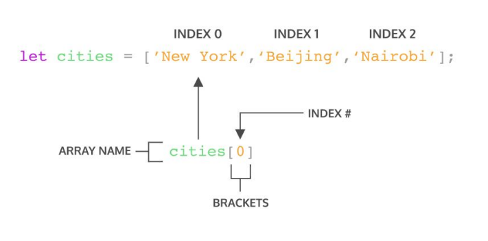
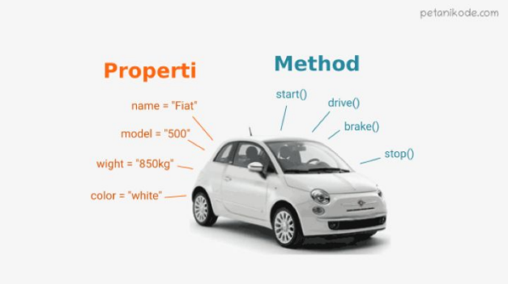

# **Writting & Presentation Test Week 3**
# **Day 1 Array & Multidimensional Array**
## **Pengertian Array**
Array adalah tipe data list order yang dapat menyimpan banyak data sekaligus didalamnya, array di dalam JavaScript dapat menyimpan berbagai macam tipe data yang berbeda, baik tipe data primitive seperti string, number, boolean, ataupun tipe data non primitive seperti object.
### **Contoh :**
```
let hewan = ["Kucing", "Anjing", "Kelinci"];

console.log(hewan); // Output ["Kucing", "Anjing", "Kelinci"]
```
>Biasanya array di deklarasikan didalam sebuah variabel dengan menggunakan simbol square bracket "[]", untuk memisahkan antara index 1 dan index lainnya kita dapat memberikan "," di penghujung value.

### **Contoh jika array diisi dengan berbagai macam tipe data :**
```
let mahasiswa = ["Fazlu", 20, true];

console.log(mahasiswa); // Output ["Fazlu", 20, true];
```

## **Cara mengakses array**
Array pada JavaScript dihitung dari index ke-0 yang merupakan representasi dari data pertama yang ada di dalam array.



### **Contoh cara mengakses index array :**
```
let productTeam = ["Product Manager", "UI & UX Designer", "Front-End Developer", "Back-End Developer"];

console.log(productTeam[0],  productTeam[2], productTeam[3]); // Output "Product Manager", "Front-End Developer", "Back-End Developer"
```
>Pada contoh diatas kita coba mengakses array yang ada dengan memberikan nomor index didalam square bracket, sesuai dengan urutan yang kita inginkan dan sudah pasti index dimulai dari 0.
## **Update Array**
Berikutnya disini kita juga bisa melakukan update terhadap value dari array.
### **Contoh :**
```
let productTeam = ["Product Manager", "UI & UX Designer", "Front-End Developer", "Back-End Developer"];

productTeam[1] = "UI Designer";
console.log(productTeam[1]) // Output UI Designer
```
>Pertama kita akses terlebih dahulu index dari array yang ingin kita tuju, setelah itu baru kita melakukan assignment dan memasukan value baru yang sudah kita tetapkan kedalam index array yang sudah kita seleksi.

## **Const In Array**
Perbedaan jika kita menggunakan `const` kita tidak dapat melakukan update atau merubah array menjadi array yang baru, tetapi kita tetap bisa melakukan perubahan pada value dari masing-masing index.
### **Contoh penggunaan const**
```
const mahasiswa = ["Fazlu"];
mahasiswa.push(20);

console.log(mahasiswa[1]) // Output TypeError: assignment to constant variabel.
```
>Kita tidak bisa melakukan perubahan dengan menambahkan index baru jika menggunakan const

## **Array Properties**
### **Apa itu properties ?**
Properties adalah merupakan fitur yang sudah disediakan oleh JavaScript untuk memudahkan developer, salah satu contoh dari properties array yang sering digunakan adalah properties `.length`.
### **Contoh penggunaan length :**
```
const productTeam = ["Product Manager", "UI & UX Designer", "Front-End Developer", "Back-End Developer"];

console.log(productTeam.length); // Output 4;
```
>Dengan menggunakan properties length kita dapat melihat jumlah atau panjang index pada array productTeam.

## **Array Method**
Array memiliki method bawaan atau built-in method, yang artinya JavaScript sudah memudahkan kita dengan menyediakan function / method umum yang biasa kita gunakan. Jadi kita tidak perlu membuat function secara manual untuk memproses sesuatu, contohnya jika kita ingin melooping array.

### **Contoh beberapa array built-in method :**
- `.push()` : adalah method untuk menambahkan item array pada urutan paling akhir.
- `.pop()` : adalah method yang menghapus item array dari index terakhir.
- `.shift()` : adalah method untuk menghapus item array pada index pertama.
- `unshift()` : adalah method untuk menambahkan item array pada index pertama.
- `sort()` : adalah method untuk mengurutkan array secara ascending atau descending alphanumerik.
### **Looping menggunakan built-in method pada array**
`forEach()` : adalah method untuk melakukan looping pada setiap elemen array.
### **Contoh :**
```
    let arrayOfNumber = [1, 2, 3, 4, 5];
    let urutan = arrayOfNumber.forEach((number) => {
        console.log(number);

        //Output
        //1
        //2
        //3
        //4
        //5
    })
```
>Dengan menggunakan foreEach() kita bisa melakukan looping pada tiap isi dari arrayOfNumber tanpa merubah isi dari array tersebut.

`map()` : adalah method perulangan yang dapat mengembalikan array baru.
### **Contoh :**
```
    let arrayOfNumber = [1, 2, 3, 4, 5];
    let urutan = arrayOfNumber.map((number) => {
        return `Urutan ke ${number}`;
    })

    console.log(urutan);

    //Output
    //Urutan ke 1
    //Urutan ke 2
    //Urutan ke 3
    //Urutan ke 4
    //Urutan ke 5
```
>Method map juga mempunyai kemampuan untuk melakukan looping seperti method forEach, tapi sebenarnya mapping disini mempunyai kemampuan khusus yang dapat merubah isi dari array per-index dengan operasi tertentu dan mengembalikan array yang baru dengan menggunakan keyword return.
### **Kapan harus menggunakan forEach dan kapan harus menggunakan map ?**
Setelah melihat contoh yang ada diatas maka dapat kita simpulkan, jika kita membutuhkan looping yang dapat melakukan perubahan pada array dan dapat menggunakan return kita bisa menggunakan map(), dan jika kita ingin melakukan looping tanpa membuat perubahan dan tanpa mengembalikan apapun kita bisa menggunakan forEach().
## **Array Multidimensional**
Multidimensional Array bisa dianalogikan dengan array of array. Yang artinya adalah array yang ada didalam array.
### **Contoh Array Multidimensi**
```
let arrayOfNumber = [1, 2, 3, [4, 5, 6]];

//Mengakses array dengan value 5 yang ada dalam index ke 3
console.log(arrayOfNumber[3][1]); // Output 5
```
>Kita bisa memasukan array ke dalam index dari array lainnya. Itulah yang disebut dengan array multidimensi

<br/>

# **Day 2 Object**
## **Pengertian Object**
Object pada programming artinya adalah representasi dari suatu tipe data yang memiliki properties dan method di dalamnya yang dapat diakses dari luar maupun dari dalam.
- Properties : adalah kumpulan data dari sebuah object
- Method : adalah action atau process yang bisa dijalankan dari object tersebut.
### **Contoh properties dan method pada object mobil :**


>Pada contoh gambar berikut dapat terlihat bahwa sebuah mobil mempunyai properties dan method, properties disini terdiri dari kumpulan data pada mobil tersebut, sedangkan method disini terdiri dari fungsi-fungsi atau proses yang bisa dilakukan oleh mobil.

## **Cara membuat object**
```
let mahasiswa {
    nama : "Fazlu Rachman",
    umur : 20,
    jurusan : "Sistem Informasi",
    lulus : false
}

console.log(mahasiswa) // Output show object mahasiswa
```
>Sama seperti membuat array, sebuah object dapat kita assign ke dalam variabel, bisa disebut dengan object literal. Kita juga bisa menyimpan berbagai tipe data di dalam object, sama seperti array sebelumnya.

## **Cara Mengakses object dan propertinya**
```
let mahasiswa {
    nama : "Fazlu Rachman",
    umur : 20,
    jurusan : "Sistem Informasi",
    lulus : function cekKelulusan(){
        //aksi
    }
}

console.log(mahasiswa.nama); // Output Fazlu Rachman
console.log(mahasiswa.umur); // Output 20
```
>Untuk dapat mengakses baik properties ataupun method pada object, kita dapat memanggil nama object lalu dilanjutkan dengan menambahkan operator "." lalu nama key yang ingin kita akses valuenya.

```
let mahasiswa {
    nama : "Fazlu Rachman",
    umur : 20,
    jurusan : "Sistem Informasi",
    lulus : function cekKelulusan(){
        //aksi
    },
    'current address' : 'jambi, indonesia'
}

console.log(mahasiswa['current address']); // Output jambi, indonesia
```
>Jika kita ingin menggunakan spasi pada key kita dapat menggunakan single quote, tapi jika kita ingin mengaksesnya kita harus menggunakan square bracket sama seperti array, bedanya kita tidak menggunakan nomor index melainkan nama key=.

## **Update Data pada Object**
Object dapat menambahkan key dan value baru jika kita mendeklarasikannya dengan menggunakan let, tapi jika kita menggunakan const maka akan menyebabkan error seperti sebelumnya, sama seperti jika kita ingin merubah array yang kita deklarasikan dengan const. Jadi jika membutuhkan 
fitur update pada seluruh data object, gunakan ‘let’ pada saat deklarasi variabel.

### **Contoh :**
```
let mahasiswa {
    nama : "Fazlu Rachman",
    umur : 20,
    jurusan : "Sistem Informasi",
    lulus : function cekKelulusan(){
        //aksi
    },
    'current address' : 'jambi, indonesia'
}

mahasiswa.ipk = 3.80;

console.log(mahasiswa.ipk); // Output 3.80;
```
>Disini kita memanggil object mahasiswa lalu melakukan assignment ke key yang tidak ada, maka secara otomatis key tersebut akan ditambahkan ke object mahasiswa.

## **Delete Data pada Object**
Kita dapat menghapus properti dari object menggunakan delete
operator.
### **Contoh :**
```
let mahasiswa {
    nama : "Fazlu Rachman",
    umur : 20,
    jurusan : "Sistem Informasi",
    lulus : function cekKelulusan(){
        //aksi
    },
    'current address' : 'jambi, indonesia'
}

delete mahasiswa['current address'];
delete mahasiswa.lulus;

console.log(mahasiswa); // Output current address, lulus is delete from mahasiswa.
```
>Gunakan keyword delete lalu dilanjutkan dengan nama object lalu key dari properti / method yang ingin dihapus.

## **Method**
Jika value yang kita masukkan pada property berupa functionn maka itu disebut sebagai method. Jika kita ingin melakukan console.log() itu berarti kita sama saja memanggil function .log(), yaitu adalah method milik console yang merupakan object global pada JavaScript. Selain memanfaatkan method yang sudah ada, kita juga bisa membuat method customize kita sendiri.

### **Contoh :**
```
const greeting = {
    welcome : () => 'Halo selamat datang',
    afterTransaction : function(){
       return 'Terima kasih sudah membeli produk kami'
    } ,
};

console.log(greeting.welcome()); // 'Halo selamat datang'
```
>Kita bisa memasukan baik anonymous function ataupun arrow function ke dalam key dari object.

## **Nested Object**
Nested object adalah object yang ada di dalam object lainnya, mirip seperti array multidimensi yang merupakan array yang ada di dalam index array.
### **Contoh :**
```
const news = {
    title : 'Impact Byte menjadi Unicorn',
    description : 'Lorem ipsum dolor sit amet, consectetur adipiscing elit.',
    author : {
        people : {
            name : 'David Winalda',
            age : 25,
            city : 'bandung',
        }
    }
};

console.log(`News : ${news.title}`); // Output Impact Byte menjadi Unicorn
console.log(`Article published by, ${news.author.people.name}`); // Output David Winalda
```
>Pada contoh diatas kita berhasil mengambil object people dengan properti name yang merupakan turunan dari object author dan news.

## **Passed by reference**
Kita bisa mengubah data yang ada pada object melalui sebuah function dan memasukkan object sebagai parameter
function. Ini biasa disebut passed by reference.
### **Contoh penggunaan :**
```
let someone = {
    nama : 'Aju',
    status : 'Mahasiswa'
};

let changeData = obj => {
    obj.nama = 'Fazlu';
    obj.status = 'Pekerja;
}

changeData(someone);
console.log(someone.nama); // Fazlu
console.log(someone.status);// Pekerja
```
>Dengan menggunakan function changeData diatas kita bisa merubah isi dari object someone.

## **Looping Object**
Tidak hanya array kita juga bisa menampilkan keseluruhan object properties dengan menggunakan looping, dengan begitu kita tidak perlu mengaksesnya tiap properti dengan manual.
### **Contoh Looping Object menggunakan for in :**
```
const news = {
    title : 'Impact Byte menjadi Unicorn',
    description : 'Lorem ipsum dolor sit amet, consectetur adipiscing elit.',
    author : {
        people : {
            name : 'David Winalda',
            age : 25,
            city : 'bandung',
        }
    }
};

//Looping isi tiap key value dari object news.
for(let key in news) {
    console.log(news[key]);
}

//Looping isi dari object people yang merupakan nested dari object author dan news.
for(let key in news.author.people) {
    console.log(news.author.people[key]);
}
```
>Dengan menggunakan for in kita bisa melooping tiap properti yang ada di dalam object yang kita arahkan.

<br/>

# **Day 3 Rekursif Function**
## **Apa itu Rekursif ?**
Rekursif adalah merupakan paradigma yang biasa digunakan untuk case matematika, fisika, kimia, dan yang berhubungan dengan calculation. Penggunaan rekursif bisa dilihat pada function yang didalam blocksnya memanggil dirinya sendiri untuk di proses.
### **Contoh kasus dan penggunaan rekursif :**
```
function refactorial(n) {
    if(n == 1){
        return 1;
    }else {
        return n * refactorial(n-1);
    }
}

console.log(refactorial(5)); // Output 120
```
>Dengan menggunakan rekursif yang dapat memanggil dirinya sendiri, kita bisa melakukan operasi refactorial menjadi lebih sederhana dan mudah dibaca.

### **Ciri dari rekursif**
- Fungsi rekursif selalu memiliki kondisi yang menyatakan kapan fungsi tersebut berhenti. Kondisi ini harus dapat dibuktikan akan tercapai, karena jika tidak tercapai maka kita tidak dapat membuktikan bahwa fungsi akan berhenti, yang berarti algoritma kita tidak benar.

- Fungsi rekursif selalu memanggil dirinya sendiri sambil mengurangi atau memecahkan data masukan setiap panggilannya. Hal ini penting diingat, karena tujuan utama dari rekursif ialah memecahkan masalah dengan mengurangi masalah tersebut menjadi masalah-masalah kecil.

<br/>

# **Day 4 Asyncronus JavaScript & Promise**
## **Apa itu proses Asyncronus pada JavaScript?**

## **Pengertian Asyncronus pada JavaScript**
Asyncronus adalah proses yang dilakukan secara non-blocking yang artinya kita bisa melakukan proses tersebut sembari menjalankan proses lainnya, sehingga tidak akan menghambat antrian proses berikutnya. Biasanya kita akan menggunakan proses asyncronus jika kita ingin melakukan proses yang eksekusinya membutuhkan waktu yg terbilang cukup lama, contohnya jika kita ingin mengambil data dari API.
### **Berikut adalah handler yang dapat kita gunakan untuk menangani proses asyncronus :**
- Callback : memasukan sebuah function ke dalam argument dari function untuk menangkap proses dari asyncronus.
- Promise : meggunakan object yang merupakan representasi dari request pengolaan data secara asyncronus.
- Async await : fitur baru JavaScript sejak ES2017 yang dapat memudahkan kita dalam menangani proses asyncronus.

### **Contoh jika menggunakan callback**
```

```
### **Contoh jika menggunakan promise**
```

```
<br/>

# **Day 5 Web Storage**
## **Local Storage**
LocalStorage adalah web storage API yang merupakan tempat penyimpanan data di browser. Penyimpanan ini memungkinkan aplikasi web atau aplikasi javascript menyimpan data secara lokal tanpa terhubung ke internet. Localstorage dapat menyimpan data secara permanent, jadi sangat berbeda dengan session yang datanya akan hilang saat jendela browser ditutup.
### **Beberapa method yang bisa kita gunakan pada Local Strorage :**
- `localStorage.setItem(key, value)` : memasukan data ke local storage dengan mengirimkan key dan value ke argument setItem().
- `localStorage.getItem(key)` : mengakses value dari local storage dengan key tertentu.
- `localStorage.removeItem(key)` : menghapus data pada local storage dengan key tertentu.
- `localStorage.clear()` : digunakan untuk menghapus semua data.
- `localStorage.key()` : digunakan untuk mengambil nomor dari setiap key.
>Tidak terdapat metode untuk update data. Cara update data yang bisa kita lakukan adalah dengan mengganti value dari key yang dituju dengan menggunakan perintah setItem()

### **1.Menyimpan dan Menampilkan Data**
```
<!DOCTYPE html>
    <html lang="en">
    <head>
        <meta charset="UTF-8">
        <meta http-equiv="X-UA-Compatible" content="IE=edge">
        <meta name="viewport" content="width=device-width, initial-scale=1.0">
        <title>Local Storage</title>
    </head>
    <body>
        <button onclick="add()">Tambah</button>
        <br><br>
    
        <div id="data"></div>
    
        <script>
    
            function add(){
    
                //save data to localstorage
                localStorage.setItem('name', 'Fazlu')
    
                //get data 
                var data = localStorage.getItem('name')
                
                //show data
                document.getElementById('data').innerHTML = data
            }
        </script>
    </body>
    </html>

```

### **2. Menyimpan dan Menampilkan Data Array**
```
<!DOCTYPE html>
<html lang="en">
<head>
    <meta charset="UTF-8">
    <meta http-equiv="X-UA-Compatible" content="IE=edge">
    <meta name="viewport" content="width=device-width, initial-scale=1.0">
    <title>Local Storage</title>
</head>
<body>
    <button onclick="add()">Tambah</button>
    <br><br>

    <ul id="data"></ul>

    <script>

        function add(){

            var id = 0
            var list = []

            var data = {
                name    : 'Fazlu, 
                age     : 20, 
                address : 'Jambi'
            }

            //save data to localstorage
            localStorage.setItem('personalData', JSON.stringify(data))

            //get data and convert from string to array
            var list = JSON.parse(localStorage.getItem('personalData'))

            //show Data
            document.getElementById('data').innerHTML = `<li> ${list.name} | ${list.age} | ${list.address}</li>`
        }
    </script>
</body>
</html>

```

### **3. Menghapus Data**
```
//remove data based on key
localStorage.removeItem('data');

//remove all data
localStorage.clear()
```