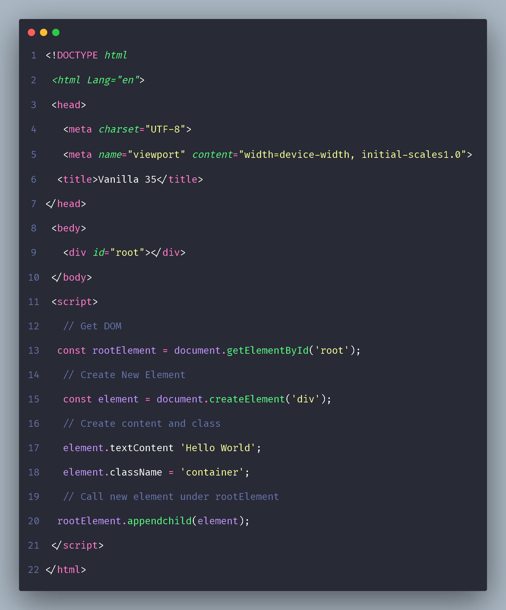
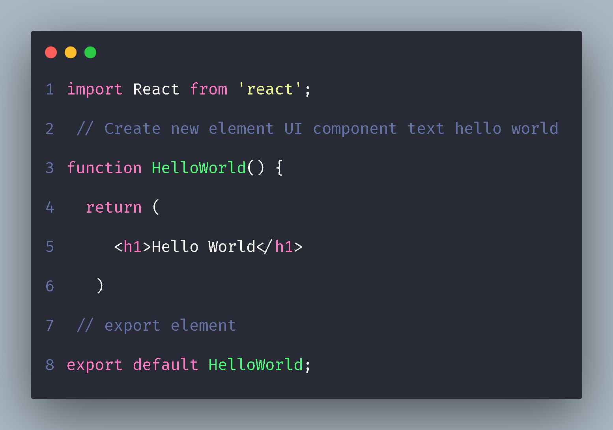
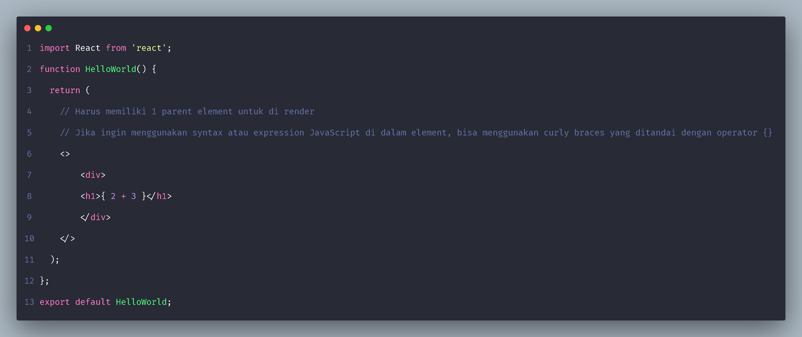
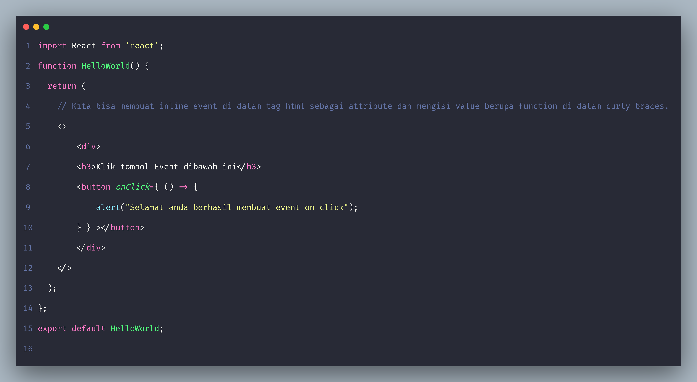
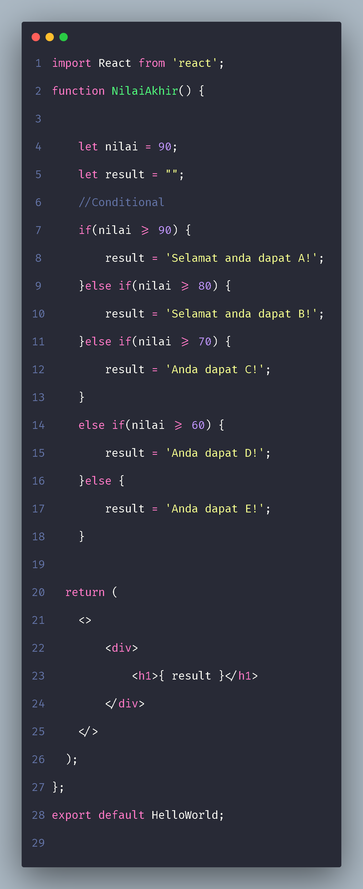
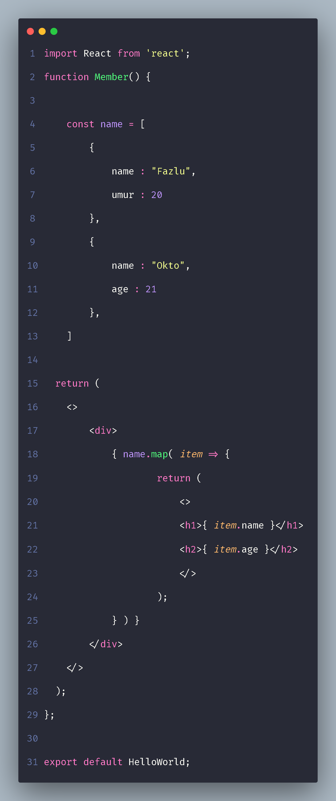
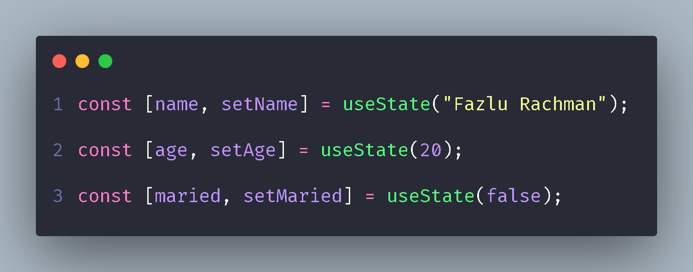

# **Writting & Presentation Test Week-6**

## **Introduction React JS Dasar**

### **Apa itu React JS ?**

React JS adalah Library atau Framework JavaScript yang biasa digunakan untuk membuat tampilan view dari User Interface atau antarmuka suatu website.

### **Kenapa kita menggunakan React JS**

- **React JS is Fast :** Artinya disini bisa diartikan kalau React JS itu dapat membuat aplikasi front-end dengan tingkat performance yang cepat, walaupun kita harus menghandle banyak data sekaligus.

- **React JS is Modular :** Artinya disini kita bisa menerapkan konsep Modular JavaScript pada React JS, yaitu berarti kita bisa membagi 1 layout pada halaman menjadi component-component kecil yang terpisah, sehingga jika kita ingin menggunakan component tersebut, kita tinggal memanggilnya saja. Dengan begitu kita tidak perlu menuliskan kode yang berulang kali seperti saat kita menggunakan native seperti biasa.

- **React JS is Scalable :** Artinya disini React JS itu bisa digunakan untuk membuat aplikasi dari skala kecil hingga skala besar sekalipun. Tidak hanya web kita pun juga bisa membuat aplikasi mobile dengan menggunakan React Native.

- **React JS is Popular :** Komunitas React JS di seluruh dunia sangat besar. Kebanyakan perusahaan teknologi pun sudah menggunakan React JS, contohnya seperti : Facebook, Instragram, Netflix, Twitter, dll.

### **Contoh membuat element UI dengan Native/Vanilla JS**

 

### **Contoh membuat element UI jika kita menggunakan React JS**

 

 >Kenapa bisa ada tag html di dalam JavaScript?Yap itu adalah JSX. <br>
 > - JSX adalah syntax extension Javascript. JSX dikembangkan untuk digunakan pada React JS. 
 > - Dengan JSX kita dapat menggunakan HTML didalam file extension Javascript (.js)

### **Rules in JSX :**
- Setiap JSX hanya bisa memiliki 1 parent element.

- Kita bisa menggunakan syntax JavaScript di dalam tag element HTML dengan bantuan curly braces, contoh : `{ 1 + 2 }`

 


### **Event in JSX**



### **Conditional Rendering in JSX**



>Selain menggunakan if statement, kita juga bisa menggunakan ternary operator di dalam JSX <br>
> Contoh :
>``( result ) ? <h1>{ result }</h1> : <h1>Tidak ada data!</h1>``

### **Looping Rendering in JSX**




## **Component**

### **Apa itu Component pada React JS?**

React JS disebut Component-Based, yang artinya component itu merupakan salah satu core dari React JS. Component di dalam React JS bisa diartikan sebagai UI yang di pecah menjadi bagian-bagian kecil.

Contoh beberapa component yang bisa di pecah dari suatu halaman yaitu seperti Navbar, Card, Carousel, dan lain sebagainya.

Dengan menggunakan component, code akan menjadi reusable, sehingga kita dapat memanggilnya berulang kali layaknya function pada umumnya.

>Pada skala project, disarankan kita membuat sebuah file component terpisah, jika kita berencana ingin membuat component atau UI yang sama di berbagai halaman yang terpisah.

### **Ada 2 cara dalam membuat Component pada React JS**

- Function Component

```
function Welcome(props) {
  return <h1>Hello, {props.name}</h1>;
}
```

- Class Component

```
class Welcome extends React.Component {
  render() {
    return <h1>Hello, {this.props.name}</h1>;
  }
}
```

>Untuk saat ini Dokumentasi resmi React JS merekomendasikan kita untuk membuat component dengan function ketimbang menggunakan class.

### **Istilah Stateless & Statefull pada Component**

- Stateless Component
```
function CardName({name}) {

//Kita dapat membuat content dari element yang akan kita render dibawah menjadi dinamis dengan menjadikannya stateless component yang artinya dia hanya bermodalkan props yang di dapat dari parent component

  return (
    <>
       <article>
                <h1>Halooo, {name}</h1>
       </article>
    </>
  );
};

export default CardName;
```
- Statefull Component
```
import React from 'react';
import CardName from './components/CardName';
function App() {

// Component akan disebut sebagai statefull jika kita memanggil atau membuat suatu data lalu mengirimkannya ke child component
const [ name, setName ] = useState("Fazlu Rachman");

  return (
    <>
        {/* Data name yang kita dapat dari state name kita kirimkan ke component CardName melalui props */}
        <CardName name={name} />
    </>
  );
};

export default App;
```

### **Istilah State & Props**
- State & Props adalah hal yang berhubungan
dengan Stateless & Stateful Component.

- Stateless berarti tidak memiliki state. Dia hanya memiliki props.

- Stateful berarti memiliki state dan bisa mengirim state tersebut ke component lainnya melalui props.

>Contoh dari implementasi state dan props dapat dilihat pada bagian module **Istilah Stateless & Statefull pada component** sebelumnya.

## **React JS Hooks**

### **Apa itu Hooks ?**

Hooks adalah fitur baru yang dikenalkan React JS pada tahun 2018, hooks disini dibuat untuk memudahkan penggunaan functional component agar bisa menggunakan state ataupun proses lifecycle lainnya.

Sebelumnya, state (setState) dan lifecycle (componentDidMount, componentDidUpdate) hanya bisa digunakan di class component, namun dengan hooks, kita bisa menggunakannya di functional component dengan mudah.

### **Perbedaan penggunaan State di Class Component dan Functionan Component**

- Class Component
```
class component extends React.Component {
    constructor(props) {
        super(props);
        this.state = { name: "Fazlu Rachman" };
    }

    render() {
        return <h1>Halo, {this.state.name}</h1>;
    }
}
```

- Functional Component
```
import { useState } from "react";

function App() {
    const [name, setName] = useState("Fazlu Rachman");

    return (
        <h1>Halo, { name }</h1>;
    )
}

export default App;
```

>Kedua Component diatas menghasilkan hal yang sama, namun class menggunakan state, dan functional menggunakan state hooks. <br> <br> Bisa dilihat dari code sebelumnya, bahwa dengan menggunakan functional component dan menggunakan hooks, maka code akan terlihat lebih clean, pendek, dan mudah dimengerti Tim yang sudah mendevelop React pun, merekomendasikan untuk mulai menggunakan hooks karena lebih mudah dimengerti.

### **Apa itu useState ?**



useState adalah hooks yang dapat kita gunakan untuk membuat state pada functional component. Struktur dari useState terdiri dari array dengan 2 element, yaitu element pada index pertama berfungsi sebagai getter(cth:name) sebagai representasi dari state, dan yang satunya lagi setter(cth:setName) sebagai method yang digunakan untuk melakukan update atau perubahan pada state.

### **Apa itu useEffect hooks ?**

useEffect merupakan hooks yang bisa digunakan untuk melakukan proses lifecycle pada functional component dengan mudah.

#### **Apa itu lifeCycle ?**

- lifeCycle bisa dianalogikan seperti lingkaran kehidupan selama 24 jam, mulai dari bangun tidur hingga tidur lagi.

- lifeCycle yang ada di dalam hooks(useEffect), mempunyai kemampuan untuk menggabungkan componentDidMount, componentDidUpdate, dan componentWillUnmount. Keempat fungsi tersebut merupakan fungsi lifeCycle yang ada di dalam class component.

#### **lifeCycle Structure**

- Mounting : Proses inisialisasi state hingga rendering.

- Updating : Melakukan rendering ulang pada component tertentu secara spesifik, jika terjadi perubahan.

- Unmounting : Proses penghapusan dan unrendering.

#### **Penggunaan useEffect**
```
//Kita melakukan import terlebih dahulu
import { useEffect, useState } from "react";

function App() {

    //Membuat state
    const [name, setName] = useState(true);
    const [change, setChange] = useState(0);

    //Panggil useEffect untuk menghandle lifeCycle
    useEffect( () => {

        //Tampilkan di console jika ada trigger mount
        console.log('ada perubahan !');

        //Update state jika terjadi mount update
        setChange(change + 1);

        //Masukan state ke dalam bracket operator sebagai target lifeCycle, tujuannya untuk menghindari terjadinya infinity re-render
    }, [name]);

    return (
        <div>
            <h1>Perubahan : {change}</h1>
            <button onClick={() => setName(!name)}>Ubah</button>
        </div>
    );
}
```

#### **Penting**
>useEffect bisanya digunakan saat kita membuat suatu call APi, karena API akan selalu dipanggil saat komponen terbentuk, maka call API bisa dilakukan di dalam useEffect. <br> Hooks seperti useState dan useEffect harus selalu dipanggil di bagian atas component, yaitu biasanya langsung setelah pembuatan function component.

